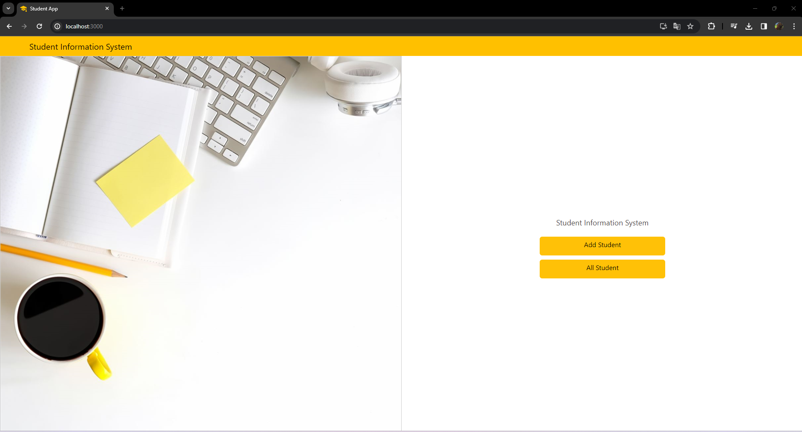
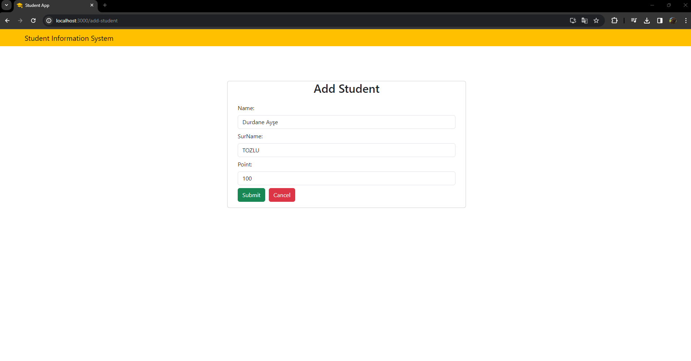
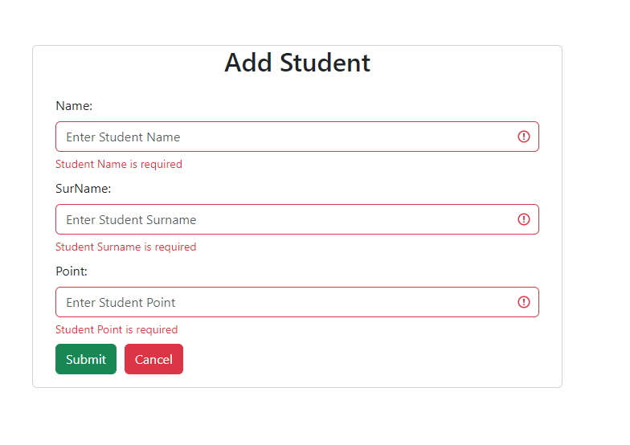
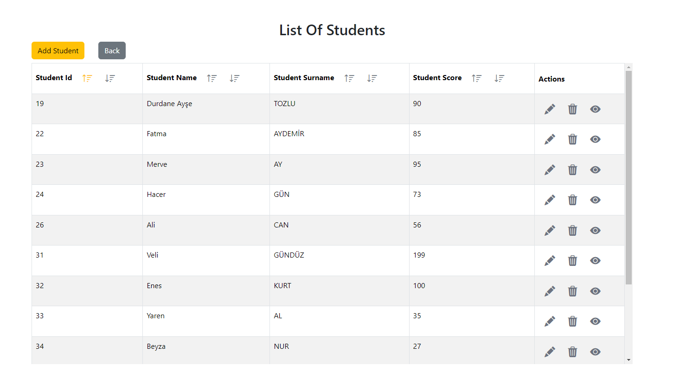
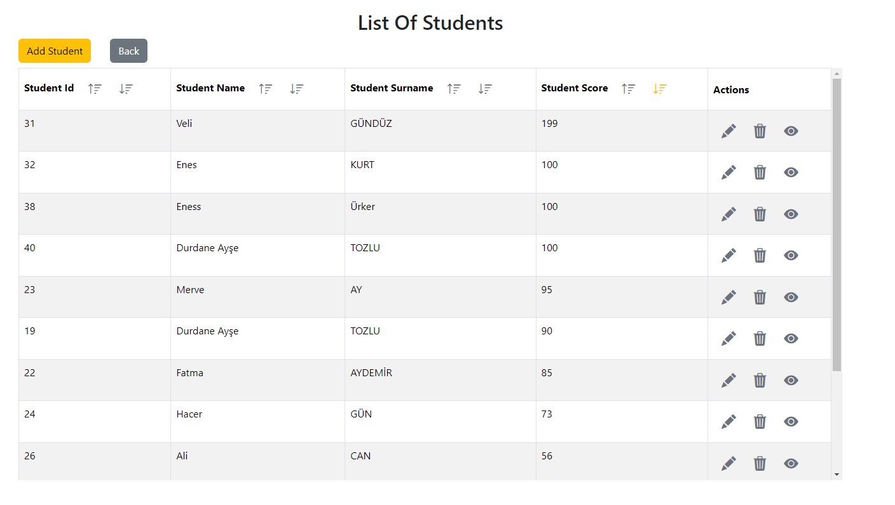
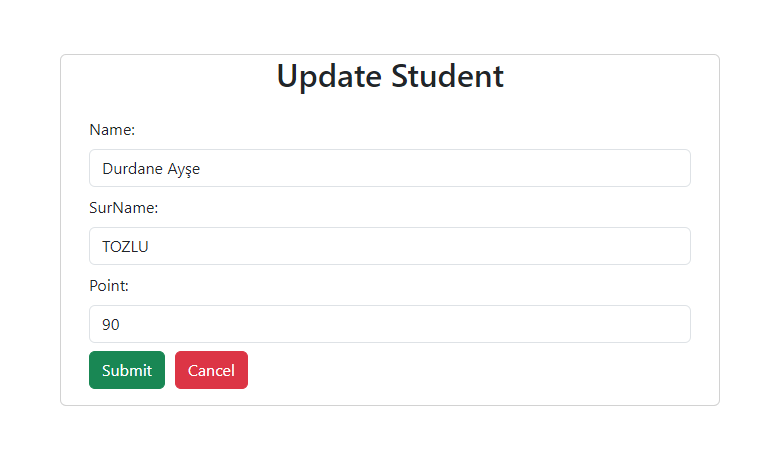
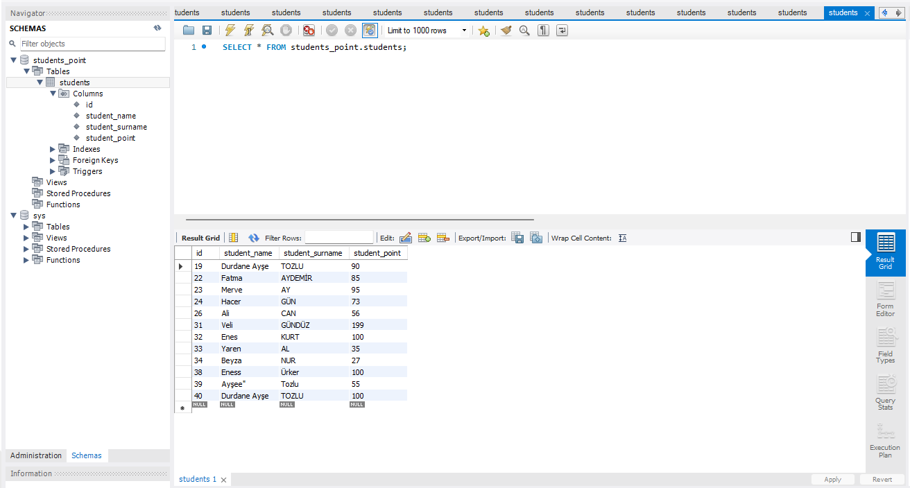
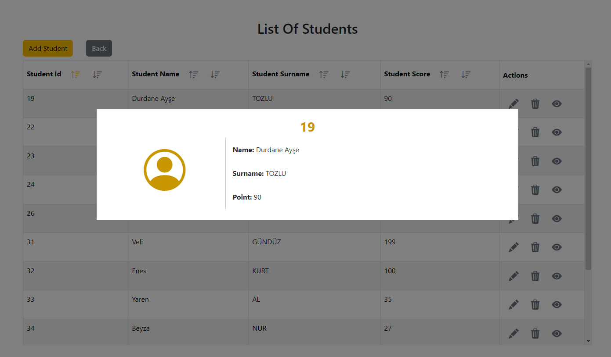

# Springboot-ReactJs

Bu proje, Spring Boot ve ReactJS kullanılarak geliştirilmiş bir web uygulamasını içermektedir. Projede, bir öğrenci yönetim sistemi üzerine çalışılmıştır.

## Proje Hakkında

Proje, öğrenci bilgilerini kaydetme, güncelleme, silme ve görüntüleme gibi temel özellikleri içeren basit bir öğrenci yönetim sistemini barındırmaktadır. Projenin temel amacı, Spring Boot ile sunucu tarafını ve ReactJS ile istemci tarafını entegre etmek ve bu teknolojiler arasında etkileşimli bir bağlantı sağlamaktır.

## Ekran Görüntüleri

*Ana Sayfa: Projenin giriş sayfası.*

*Yeni Öğrenci Ekle: Yeni öğrenci eklemek için kullanılan sayfa.*

*Yeni Öğrenci Ekle: Yeni öğrenci eklemek için kullanılan sayfad.*

*Öğrenci Listesi: Eklenilen bütün öğrencileri listelemek için kullanılan sayfa.*

*Öğrenci Listesi: Eklenilen bütün öğrencileri listelemek için kullanılan sayfa.*

*Öğrenci Bilgi Güncelle: Eklenilen öğrencilerde değişiklik için kullanılan sayfa.*

*Database: Arkaplandaki database görüntüsü*

*Poup: Öğrencilerin bilgilerini görüntülemek için kullanılır*
